# 电机学

## P1 概述

#### 定义

电机在进行能量转换或能量传递的过程当中，是以磁场为媒介。这个时候磁场要动起来，那么磁场有一个速度，电机转子（可动部件）也有个转速。

#### 电机的分类

1. 按所应用的电流种类，电机可以分为直流电机和交流电机
2. 按能量转换功能和用途可分为：变压器、电动机、发电机和控制电机。实际上，变压器是不动的电机，电机是旋转起来的变压器
3. 按运行转速的特点，电机又可以分为：变压器（**转速为0**），直流电机（**转速不固定**），感应电机即异步电机（**电机转子的转速和磁场的转速有一个差**），同步电机（***电机转子的速度和磁场的速度始终保持相同**）

#### 电机的主要发展

1. 1982年法拉第电动机

法拉第发现了载流导体在磁场当中要受力（安培力+左手定则），由此有了电动机的雏形。

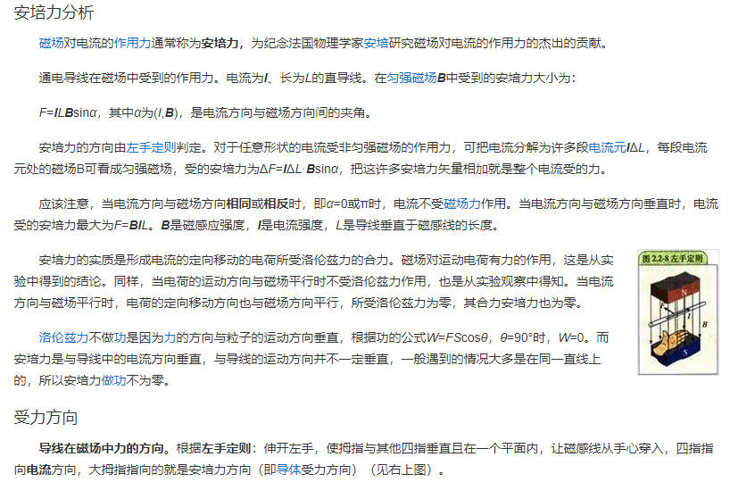

2. 运动的导体在磁场当中要感应电势（电磁感应定律+右手定则），由此形成了发电机的雏形。

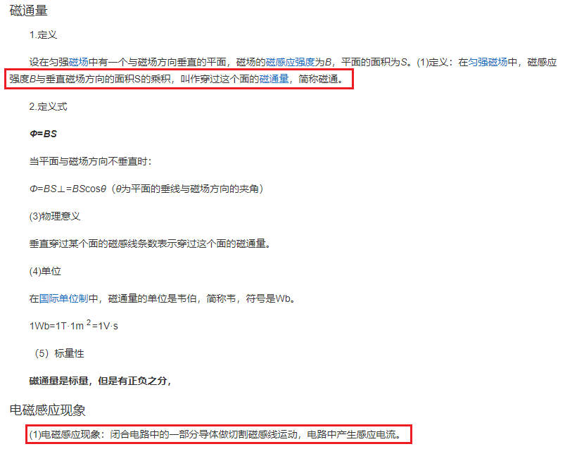

## P2 基础理论

### 磁场中的基本物理量与磁路的概念

#### 磁场基本物理量

###### 1. 磁感应强度

电流（运动电荷）的周围存在磁场，其大小为磁感应强度。

*毕奥-萨伐尔定律*

磁感应强度B，表示某一个点的磁场大小，单位为特斯拉T。

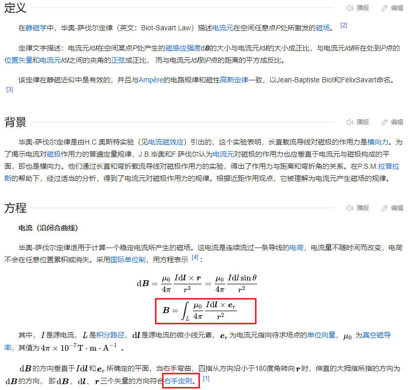

##### 2. 磁通量$\phi$

磁通量表示某一个面的磁场大小，单位为韦伯。可以看到，$B=\phi/S$，所以磁感应强度又常被称作磁通密度，简称磁密。

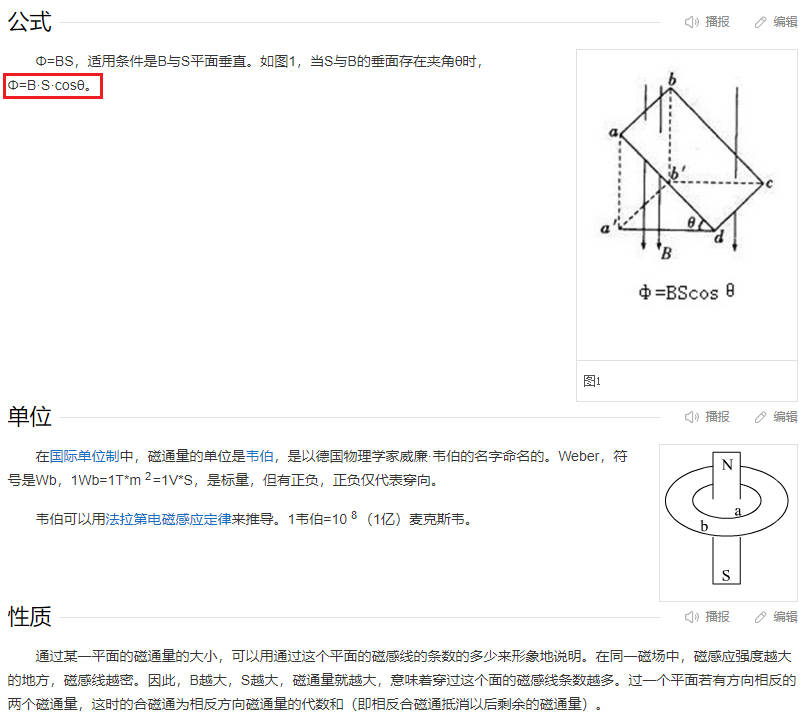

##### 3. 磁导率$\mu$

我们把通电线圈绕在圆柱体上，就会在空间内产生磁场。如果把圆柱用木质材料来做，和把圆柱用铁磁材料来做，在同一点产生的磁场强弱是否一致？

*显然不同。*

因此，磁场所处的材料的磁的性能，也许哟一个物理量来描述，这就是磁导率。

**磁导率表征的是这个材料对磁场的导磁性能，磁导率越高表示导磁性能越好，磁导率越低表示导磁性能越弱。**

通常我们已空气中的磁导率，或真空中的磁导率为基准，记作$\mu_0=4\pi\times10^{-7}H/m$，其他材料的磁导率记作$\mu=\mu_r \times \mu_0$，$\mu_r$叫做这个材料的相对磁导率，$\mu_r$等于1就是真空，$\mu_r$也可以大于或小于1。

一般情况下，铁磁材料的磁导率是很高的，他的相对磁导率一般远大于1，可以达到5000-6000倍的$\mu_0$，铜的相对磁导率和$\mu_r$和1非常接近。所以，磁场处在不同的环境中时，反映的磁场强弱是不一致的。

有没有磁导率为0的物质？任何物质都是导磁的，只不过导磁的程度不同。

##### 4. 磁场强度$H$

磁感应强度B和磁场所处的材料有关，所处的材料不同时，磁感应强度B是不同的。

那么磁场是由电流所产生的，电流相当于一个源，如何反映这个源的作用？对于磁场放在铁磁材料和非铁磁材料中，磁感应强度B不同，但是电流的贡献时一致的，如何来体现这个电流的贡献呢？

*引入物理量，磁场强度，他体现的是这个电流所产生的磁场的大小。*

$$
\overrightarrow{B}=\mu \times\overrightarrow{H}
$$

上面的方程反应了磁感应强度和H之间的相互关系。从物理本质上来讲，B是一点的磁场的强弱，他反应了磁性能。H反应的是这个源电流的贡献的大小。

##### 5. 角位移

电机一般是旋转的，在做直线运动时，我们常说的速度$v=dr/dt$，那么电机旋转的速度就是$d \theta / dt$。

#### 磁路

通电导线绕在圆柱体上后，会在它周围产生一个磁场，我们可以用磁力线来表示，也可以称为磁通或磁通量。这个时候，磁通所走过的路径就定义为磁路。

以下图为例，我们用铁磁材料做个这样的一个铁框，在上面绕上线圈并通上电流，此时在它周围就会产生一个磁场。这个时候由于铁框是由导磁材料做成的，它的导磁性能非常好，周围这些地方是空气，所以这个时候磁通所走的路径就是红色的部分，主要在铁磁材料里面走。

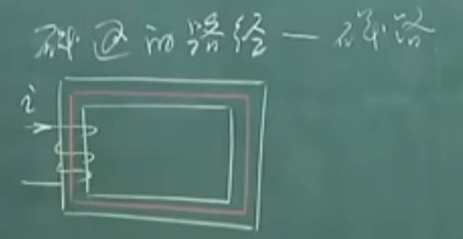

如果我们用铁磁材料做成一个环，在环里面再放一个铁磁材料做的圆柱，在圆柱上绕上线圈并通电，这个时候在它的周围也会形成一个磁场。那么，磁通肯定是走磁阻最小的路径，由于这两个都是铁磁材料，所以磁通会走环形路径，这样也构成了磁路。

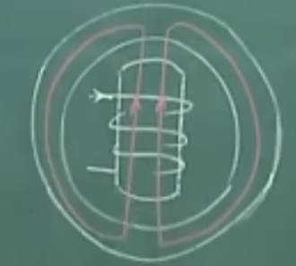

由于在物质世界中，没有任何物质是绝磁的，所以这个时候产生的磁场大部分从这条红色的磁路里面走了，但由于空气也不是绝磁的，所以还是有一部分磁通从空气中走了。

为了区分这两种不同的磁路，我们把大部分磁通所走的路径，实际上也是电机和变压器在工作过程当中起主要作用的，对能量转换起作用的这部分磁路，我们叫做主磁路。另外一部分很少的，对能量转换没有贡献的磁通称为漏磁通，走过的路径称为漏磁路。

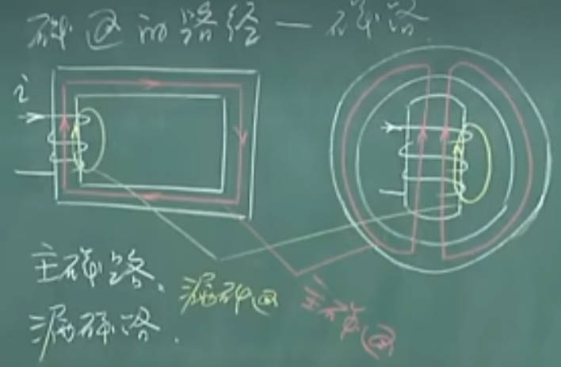

如果线圈通的是直流，这种磁路称为直流磁路。如果线圈通的是交流，就叫做交流磁路。

为了区别产生这个磁路的电流是直流还是交流，我们把线圈区分一下。

`通交流的线圈 -> 激磁线圈`

`通直流的线圈 -> 励磁线圈`

建立了磁路的概念后，给电机的分析和设计带来了很大的方便。但是，磁路的设计也有局限，它不像我们想象的那么严格。所以，本来他是一个以磁场为媒介的一个电磁装置，它是一个场的问题，我们现在用一个路的问题来等效了。*这里面有不准确的地方。*

这种近似，在最好的情况下他的误差是5%左右，误差体现在什么地方？

1. 忽略了漏磁
2. 我们在用磁路计算时，一般选择平均磁路。这个磁路有多长呢？我们可能选择在这个铁框当中的中心线，叫做平均磁路。但实际上既有走小圈的，也有走大圈的，每一条磁力线都是不一样的路径
3. 由于铁磁材料的气隙，产生的边缘效应

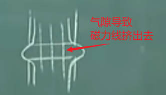

#### 基本定律

##### 1. 安培环路定律

体现的是磁场的源电流对磁场的贡献。在稳定磁场中，磁场强度沿任何闭合路径的线积分，等于闭合路径所包围的各个电流的代数和。

$\int \overrightarrow{H}· \overrightarrow{dl} = \sum i$

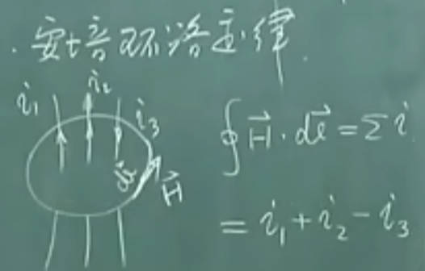

对于方框形的磁路，如果积分路径按照中间红色部分的主磁路来做，此时安培环路定理可写成$\int \overrightarrow{H}· \overrightarrow{dl} = Ni$。如果再进一步，我们认为每一点的H都是相同的，磁路的长度为L，那么安培环路定律就可以写成：

$$HL = Ni$$

从积分方程，退化成代数方程。这可以更好的解释，磁场强度反应的就是电流对磁场的贡献。因此，我们把$HL=F$中的F称为磁动势。电流是磁场的源，就像感应电动势是电场的源，相类似。

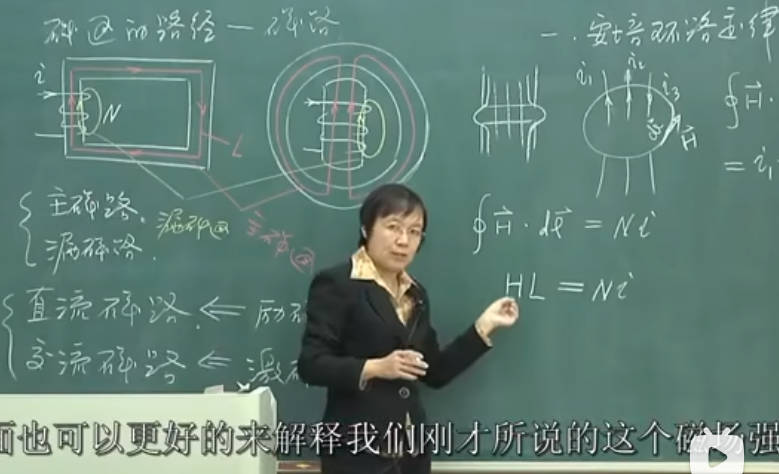

磁动势F=Ni=HL，那么这个HL又可以称为在这段路径上的磁压降。这个磁势消耗在哪了？消耗在这个磁路上的每一段路径上了。

##### 2. 磁路欧姆定律$F=HL=R_m\phi$

我们刚才已经说了，产生这个磁场的源是N个电流，我们叫做磁势，它等于这个磁路各段的磁压降，也就是$F=HL$，这实际上就是一个路的形式了。

前面我们知道，磁场强度H和磁感应强度B相关。

$$H=\frac{B}{\mu}，B=\frac{\phi}{A}，因此F=HL=\frac{L}{\mu}·\frac{\phi}{A}=R_m\phi$$

磁阻$R_m=\frac{L}{\mu A}$，我们可以知道3个结论：

1. 磁通所走的路径面积越大，磁阻越小。类似于电线越粗，电阻越小
2. 磁路越长，磁阻越大。类似于电线越长，电阻越大
3. 材料的导磁率越大，导磁性能越好，磁阻越小。类似于电阻率越大，电阻越小

既然磁阻跟电阻这么像，那串并联的性质也是通用的。

我们把磁阻和电阻相类比了，电动势和磁动势也相类比了。前面说到，电动势是电路的源，磁动势是磁路的源，那么磁通实际上相当于电路里面的什么？

磁通相当于电路里面的电流！！！电流所走过的路径叫做电路，磁通所走过的路径叫做磁路！我们再来看下二者的定义：

电流：电磁学上把单位时间里通过导体任一横截面的电量叫做电流强度，简称电流

磁通：在磁感应强度为B的匀强磁场中，有一个面积为S且与磁场方向垂直的平面，磁感应强度B与面积S的乘积，叫做穿过这个平面的磁通

从定义上看，都是穿过某个面积的电磁量！

##### 3. 磁路基尔霍夫第一定律（磁通连续性定律）

类比基尔霍夫电流定律！

穿出或进入任一闭合面的总磁通量恒等于零（进入任一闭合面的磁通量恒等于穿出该闭合面的磁通量）

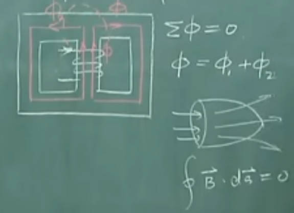

##### 3. 磁路基尔霍夫第二定律

类比基尔霍夫电压定律！

总磁势等于总的磁压降的代数和！

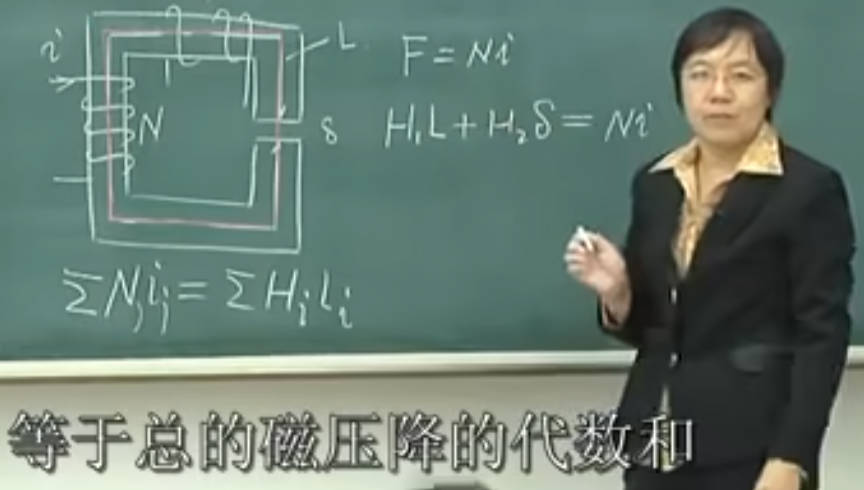

注意！这段磁路包括2部分：铁磁材料和空气。空气的磁导率为$\mu_0$，假设铁磁为$5000\mu_0$。整个的磁势分成了2部分，一部分降落在铁磁材料上，一部分降落在气隙上。哪一部分更大？

气隙的磁压降更大！在电机和变压器的电磁装置中，尽管有时气隙很小，但由于在这里的磁导率很小，所以磁压降反倒很大！

## P3 磁性材料及其特性

前面提到，任何一个材料的磁导率$\mu = \mu_r \mu_0，\mu_r为相对磁导率，\mu_0为真空磁导率=4\pi \times 10^{-7}$，根据$\mu_r$大小，可以将材料分为几种：

1. $\mu_r > 1$，顺磁材料
2. $\mu_r < 1$，反磁材料，一般有机物或无机化合物
3. $\mu_r >> 1$，铁磁材料，如铁、镍及一些合金材料

#### 1. 铁磁材料的磁化

一个铁磁材料在一般情况下不显示磁性。如果放到一个强磁场中，那么这个时候它的磁性就显现出来了，这个过程叫做铁磁材料的磁化。磁化是铁磁材料的基本特性之一。为什么会出现这种特性？

铁磁材料在通常情况下不显示磁性时，体现的是什么？铁磁材料由许多磁畴组成，一般情况下磁畴的方向是任意或混乱的，因此体现的外部特性就没有磁性。然后把铁磁物质放到强磁场当中，这些磁畴会发生扭转，按照磁场的方向排列起来，使外部磁场增强了，而这个铁磁材料本身有了磁性。

#### 2. 铁磁材料的磁化曲线

铁磁材料的首次磁化曲线如下图，称为原始磁化曲线。

1. oa段 - 起始段：磁场强度比较小，磁化弱
2. ab段 - 直线段：大多数磁畴发生扭转
3. bc段 - 饱和段：只剩下少数的磁畴了
4. cd段 - 过饱和段：实际材料中的磁畴是无限多的，此时变化非常缓慢了

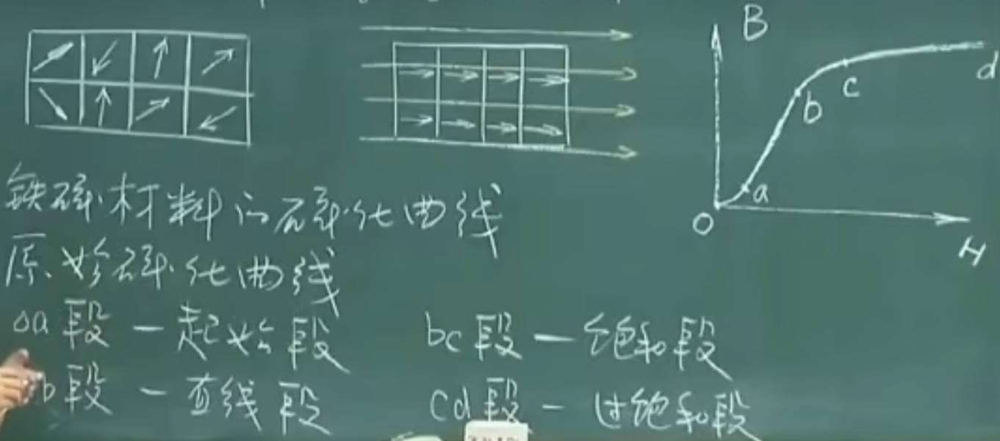

由于$B=\mu H$，可以看到实际上磁导率$\mu$不是一个常数，它随着外部磁场的变化而变化，这与电阻不同（电阻通常是恒定值）。因此通常情况下磁路都体现出非线性，$\mu$只在ab线性段为常数。通常情况下，铁磁材料的磁导率为真空磁导率的5000-6000倍。

我们在设计电机时，如果把工作点设计在ab线性段之间的话，这个时候材料没用足，因为还处于线性段中，用很小的H就能得到很大的B，但是在bd段之后用很大的H才能得到很小的B。我们为了提高材料的磁性能，一般我们在设计时，会把工作点设置在b点，这样即把材料用足了，又不浪费激磁的电源。

#### 3. 磁滞回线

刚才讲到的是，铁磁材料的原始磁化曲线。那么如果我们把磁场H逐渐减小，一直减小到0，此时铁磁的磁性会消失吗？

答案是不会，当外部磁场H减小到0时，铁磁材料会剩余一部分磁性Br，我们称为剩磁。如果希望铁磁的磁性完全消失应该怎么做，反向施加磁场即可，此时铁磁的剩磁继续减小，当反向磁场到达Hc（矫顽力）时，铁磁的磁性消失。如果继续增大反向磁场，铁磁材料会反向磁化，产生反向的原始磁化曲线。如果把反向磁场逐渐减小一直到正向磁场，铁磁的磁性和方向又会产生改变。

我们把这条磁化曲线称为磁滞回线，他是上下左右对称的。

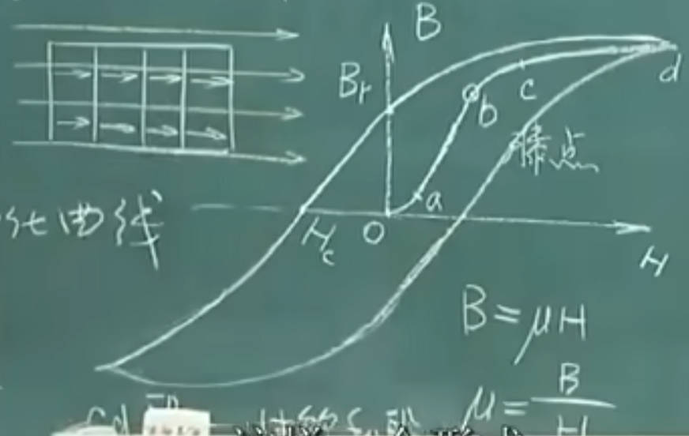

那么在工作生活中，我们使用的是原始磁化曲线，还是磁滞回线？都不是，我们用的是基本磁化曲线。

#### 4. 基本磁化曲线

在磁滞回线中，我们选定一个H值，就可以得到一条磁滞回线。逐渐增加H值，可以得到多条磁滞回线。我们把每条回环线的顶点连接起来，就是基本磁化曲线。

基本磁化曲线和原始磁化曲线很接近，但是不完全重合，基本符合。

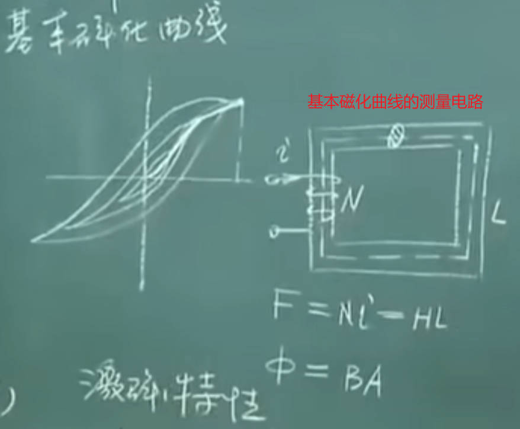

那么如何测量基本磁化曲线？

我们可以找一个铁芯做的方框，绕上线圈并通电流，通了电流就产生了磁场。我们在铁芯周围通了电流，就相当于把铁芯放在了磁场中。然后加不同的电流，铁芯里面的磁场强度不一样，就相当于给他不同的激励。由这样一个简单电路，就可以通过实验方法获得这个材料的基本磁化曲线。

如果线圈N匝，通入这个电流产生的磁势为$F=Ni=HL$。其中，L是一个常数，N是一个常数，所以磁场强度H正比与电流i。因此要增加磁场强度H，就可以增加电流。

另一角度来看，如果在铁芯方框中有一个截面A，通过他的磁通就是$\phi = BA$。面积A是常数，所以B和$\phi$就成正比。因此B-H基本磁化曲线，实际上也是电流和磁通的关系。所以，B-H曲线在工程上有时候又叫做激磁曲线（因为电流不是固定的，而是在逐渐变化增加，这就是交流不是直流，所以是激磁）。

#### 5. 铁磁材料的分类

根据磁化曲线的不同形状，铁磁材料又可以进行分类（根据剩磁的大小分类）。

1. 硬磁材料：Br、Hc比较大，剩磁比较多，磁性比较坚强。我们称为永磁铁
2. 软磁材料：r、Hc比较小，就一点点剩磁，再放置一会就没了

硬磁材料和软磁材料的磁化曲线：

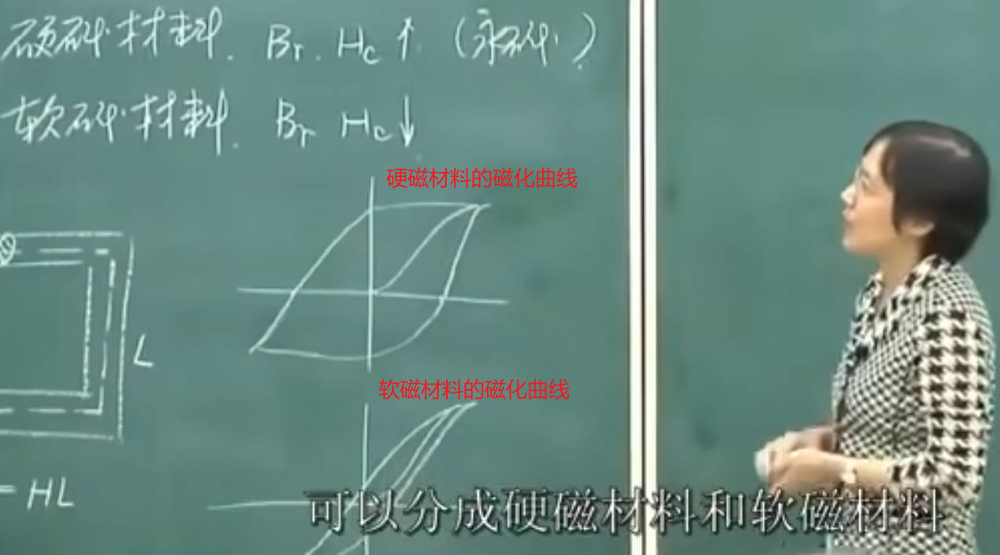

为什么会产生磁滞回线的回环，而不是延原路返回？

我们的磁场实际上相当于给一个电流激励，电流相当于一个电功率。我们说到，任何物质都有磁性。在铁芯磁化过程中，铁芯内部的磁畴是随着磁场变化而变化的，在磁畴扭转变化的过程中需要受力，需要力就意味着需要外部做功，这说明在磁化的过程中就有了能量损失。

能量损失的体现是，如果电流来回变的话，再去摸铁芯，会发现铁芯变热了，也就是在磁场变化过程中他有能量的损失。

#### 6. 铁磁材料的磁场损耗（铁心损耗）

铁芯损耗通常包括两部分：

1. 磁滞损耗：在被磁化的过程当中由于磁畴的运动需要能量，需要外部做功。是由于磁畴的运动（即磁滞现象）引起的。磁滞损耗$P_h=C_hfB_m^nV$，$C_h$是损耗系数
2. 涡流损耗：$P_e=C_ef^2B_m^2 \Delta^2 V$，$C_e是损耗系数，$\Delta$是铁芯厚度，V是铁芯体积
3. 铁心损耗：$P_{Fe}=P_h+P_e=C_{Fe}f^{1.3}B_m^2G$，$C_{Fe}是损耗系数，f是变化频率，G是铁芯重量

可以看到，直流磁路没有损耗。

